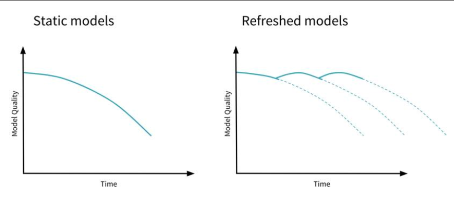

# Monitoring Machine Learning Models in Production
Like any software system, machine learning models in production also needs to be monitored. We need to monitor not only the infrastructure healthiness, but also the data shift as machine learning systems has the 'change anything change everything' feature. 

So what should we monitor in productionalized machine learning models?
- Dataset shift:

    Here we want to compare variable by variable if the distribution of the variable in the training data is similar to what we see in production for that variable.We also need to compare the prediction results distribution in the training and production environment. Practically speaking, implementing advanced statistical tests in a monitoring system can be difficult, though it is theoretically possible. More typical is to automate basic statistical tests (particularly standard deviation of inputs/outputs) over time, and do ad-hoc manual testing to apply more advanced checks. 

- Operations issues (system monitoring)
    - System performance (latency when calling ML API endpoints)
    - System performance (IO/Memory/Disk Utilisation) 
    - System reliability (Uptime)
    - Auditability 

## Dataset shift

### Types of dataset shift
How does one determine when the dataset has shifted sufficiently to pose a problem to our algorithms? If only certain features begin to diverge, how do we determine the trade-off between the loss of accuracy by removing features and the loss of accuracy by a misrepresented data distribution?
- **Covariate shift**
    Distribution of the input features change while no change in the underlying relationship (mapping function)
	
	Problem: cross validation is biased
	
- **Prior probability shift**
	
    Distribution of the target variable y shift, impact specific to Naïve Bayes algorithm p(y|x) = p(y) * p(x|y) / p(x)
- **Concept shift**

	Internal relationship between x and y changed (shift in environment which makes past cannot predict future, change in consumer behavior, adversarial scenarios such as fraudsters, criminals, natural diasters)
	i.e., time series data --- covid-19 times customer behavior changed
- **Upstream data changes** 

	Sometimes there can be operational changes in the data pipeline upstream which could have an impact on the model quality. For example, changes to feature encoding such as switching from Fahrenheit to Celsius and features that are no longer being generated leading to null or missing values, a feature is not available in production, etc.

## Identify dataset shift
- Basic statistics: median, mean, standard deviation, max/min
- Statistical Distance: plot distribution of features for train and test, measure their divergence (or statistical distance)
	
    

	Population Stability Index (PSI): 
	
	
	
	
	Histogram intersection: calculates the similarity of two discretized probability distributions (histograms), with possible value of the intersection lying between 0 (no overlap) and 1 (identical distributions)
	
	KL divergence: 
	

    Kolmogorov-Smirnov statistic: quantifies a distance between the empirical distribution functions of two samples. 
	

	

- Discriminative Distance

	Train a model to classify whether the data is from train or test. The better the classifier is, the more different the train and test data is.

## Handling dataset shift
- **Feature removal**
    
    Remove the features related to the drift. There is a trade-off between number of features and model accuracy.

- **Importance Reweighting**
    
	Reweight each of the training examples by the relative probability of the training and test set.
	Essentially, you try to change your training data set such that it looks like it was drawn from the test data set.

- **Retrain model** using more recent data (for data drift related to seasonality) regularly
	

- **Data Preparation**

    In some domains, such as time series problems, the data may be expected to change over time.
	In these types of problems, it is common to prepare the data in such a way as to remove the systematic changes to the data over time, such as trends and seasonality by differencing. This is so common that it is built into classical linear methods like the ARIMA model.

## Tools 
Dashboard can be created with Prometheus or Grafana to track our model standard statistical metrics.
Kibana, an open-source analytics and visualization platform which is part of the elastic starck, can be used to search, view, and interact with logs stored in Elasticsearch indices; other options includes logz.io and Splunk.

## Field Trend: 

The big AI players are trying to implementing their own machine learning model monitoring solution, for example Microsoft has introduced “Data Drift” in Azure ML Studio, or AWS's Amazon SageMaker Model Monitor.

Scrappy start-up attempts to build innovative tooling to ease model monitoring, for example Seldon, Data Robot, Databrick's MLFlow, superwise.ai and hydrosphere.io amongst others.

The landscape changes quickly year by year.

Reference for Tools and Field Trends: https://christophergs.com/machine%20learning/2020/03/14/how-to-monitor-machine-learning-models/