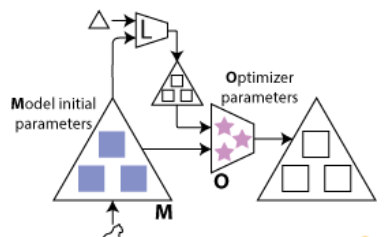
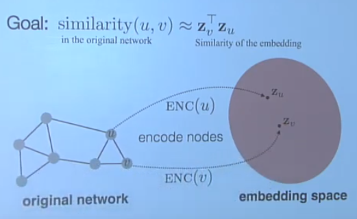
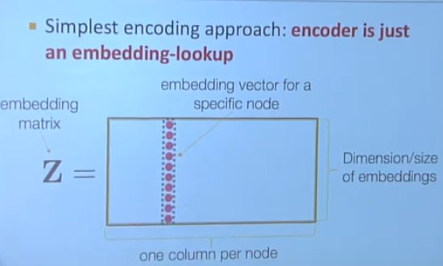
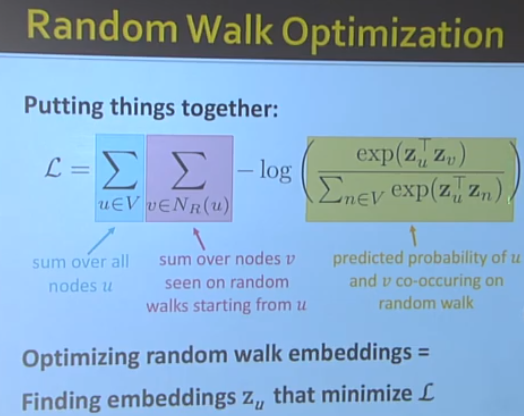
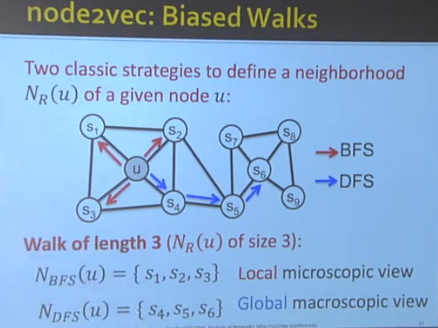
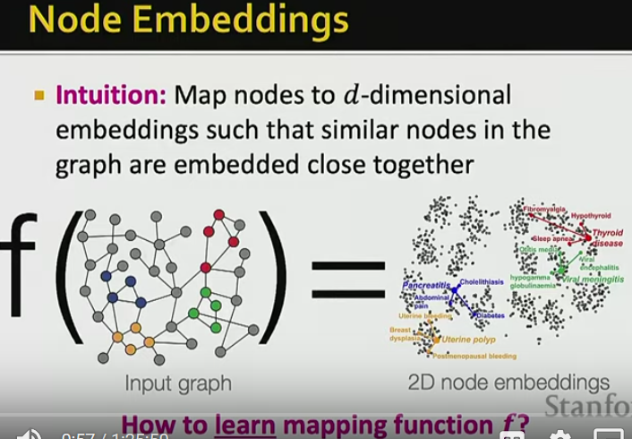
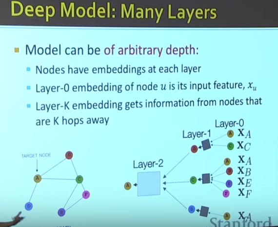
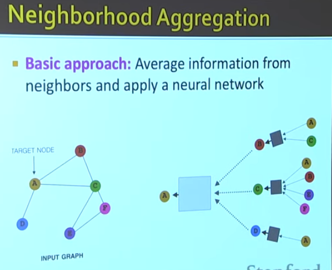
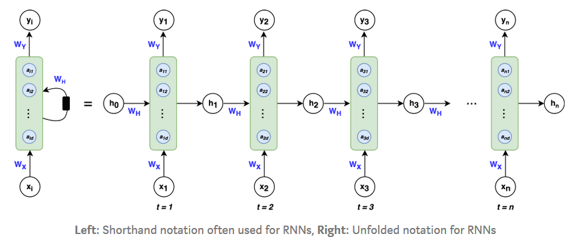
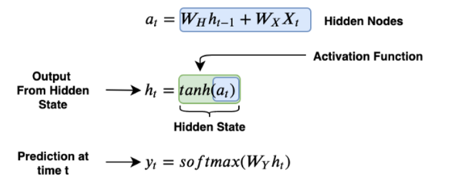

I have attended the annual KDD 2020 conference online recently and organized some of my notes as follows for future reference. It is simply my personal take-out from that conference and thus neither thorough or comprehensive. 

Main algorithms used to solve challenging industry problems are deep learning algorithms. Other traditional methods are not used much in the posters. Some main concepts widely used in this conference include:

## meta-learning
Meta-learning, in the machine learning context, is the use of machine learning algorithms to assist in the training and optimization of other machine learning models.
Creating meta-learning models and techniques can help AI learn to generalize learning methods and acquire new skills quicker.
The exact way that meta-learning is conducted varies depending on the model and the nature of the task at hand. However, **in general, a meta-learning task involves copying over the parameters of the first network into the parameters of the second network/the optimizer**.

Creating a meta-learner that has an entirely new set of parameters would be computationally expensive, and for this reason, a tactic called coordinate-sharing is typically used. Coordinate-sharing involves engineering the meta-learner/optimizer so that it learns a single parameter from the base model and then just clones that parameter in place of all of the other parameters. The result is that the parameters the optimizer possesses don’t depend on the parameters of the model.

References:
1. https://kddvirtual2020.vfairs.com
2. https://medium.com/cracking-the-data-science-interview/meta-learning-is-all-you-need-3bd0bafdf289
3. http://cs330.stanford.edu/
4. https://www.unite.ai/what-is-meta-learning/

## metric learning
Metric learning (or distance metric learning) is an optimization problem seeking to **find the parameters of a distance function (or a distance metric) that optimize some objective function** measuring the agreement with the training data. It belongs to supervised machine learning.

Depending on the type of supervision in the training data, metric learning problems may fall into two main categories:
- supervised learning: the data points available are clearly labeled as in a standard classification problem. The goal of metric learning in this setting is to learn a distance metric that puts points with the same label close together while pushing away points with different labels.
- weakly supervised learning: the data points available are labeled at the tuple level (typically pairs, triplets, or quadruplets of data points). Metric learning in this setting is to learn a distance metric that puts positive pairs close together and negative pairs far away. 

Metric learning is quite useful when we need a better way to compute the distance between data points. **For example, in high dimensional space (n > 9), Euclidean distance is a poor way to measure distance.** In face, as the number of dimensions grows, the relative euclidean distance between a point in a set grpand its closest neighbour, and between that point and its furthest neighbour, changes in some non-obvious ways. [ref 2 for details] 

A couple of applications of metric learning includes:
- Nearest neighbors models: the learned metric can be used to improve nearest neighbors learning models for classification, regression, anomaly detection.
- Clustering: metric learning provides a way to bias the clusters found by algorithms like K-Means towards the intended semantics.

References:
1. http://contrib.scikit-learn.org/metric-learn/introduction.html
2. https://stats.stackexchange.com/questions/99171/why-is-euclidean-distance-not-a-good-metric-in-high-dimensions

## Graph Neural Network (GNN)
Graph or network is a more complicated data structure than texts or images because graph has 
- complex topographical structure
- no fixed node ordering or reference point
- often dynamic and have multimodal features

Some examples of real world graph includes biological graph, medical networks, social networks, information networks, knowledge graphs, communication networks and web graph, etc. Applying machine learning in graphs are important to node classification, link prediction (which links are missing in the network), anomaly detection, and clustering. A key step in machine learning is feature engineering. Graph neural networks try to automatically learn the graph features using network embedding, that is to encode every node in the graph into a low-dimensional feature vector. Such embeedding allows for 
- distributed representation for nodes
- similarity of embedding between nodes indicates their network similarity
- encode network information and generate node representation

Such embedding is similar to automatic image feature engineering using convolutional neural network. 

The following is a 2D embedding of nodes in a network:

Here are some notes from [Graph Representation Learning lecture by Jure Leskovec at Stanford university](https://www.youtube.com/watch?v=YrhBZUtgG4E).

- similarity: cosine similarity (preferred, dot product of embeddings)
- how about node similarity? --- Random Walk or Node2Vec Approaches to node embedding, turning a matrix finding problem into an optimization problem.

p and q are the same across all nodes in the graph.

node2vec performs better on node classification and random walk performs better on link prediction.

The graph neural network will learn the mapping function f.

References:
1. https://www.youtube.com/watch?v=YrhBZUtgG4E
2. https://www.youtube.com/watch?v=7JELX6DiUxQ

## Fast library for approximate nearest neighbors (FLANN)
FLANN is a library for performing fast approximate nearest neighbor searches in high dimensional spaces. It contains a collection of algorithms we found to work best for nearest neighbor search and a system for automatically choosing the best algorithm and optimum parameters depending on the dataset.

References:
1. https://github.com/mariusmuja/flann

## Recurrent neural network
Recurrent neural network (RNN) is a neural network widely used for sequential data, including time-series data, text or audio data. RNN is different from the classical multi-layer perceptron network in the following aspects: 1) They take into account what happened previously 2) they share parameters/weights. It's also different from ResNet50, which is a convolutional network with output from the previous node as part of the input to the next node.

The architecture of an RNN looks like this:

Here are some snapshots from reference 2 to illustrate the mathematics of RNN:

H0 is a vector with all zeros.

The loss function here is log loss. The total log loss is the optimization objective.

Long Short-Term Memory (LSTM) networks are a modified version of RNN, which have resolved the vanishing gradient problem of RNN, store information for a longer period of time and thus model chronological sequences and their long-range dependencies more precisely than conventional RNNs. Below is a comparsion of unit structure between common RNN and LSTM shown in reference 3. 

Some disadvantages of LSTM includes:
- Sometimes they still fail to remove the vanishing gradient problem.
- They require a lot of resources and time to get trained and become ready for real-world applications.
- LSTMs are prone to overfitting and it is difficult to apply the dropout algorithm to curb this issue. 

References:
1. https://stanford.edu/~shervine/teaching/cs-230/cheatsheet-recurrent-neural-networks
2. https://medium.com/towards-artificial-intelligence/whirlwind-tour-of-rnns-a11effb7808f
3. https://colah.github.io/posts/2015-08-Understanding-LSTMs/
4. https://www.geeksforgeeks.org/understanding-of-lstm-networks/

## Multitask learning

Multitask learning enables you to do multiple tasks with one neural network. It allows you to do the tasks faster and with more accuracy. It is widely used in computer vision where one network is built to detect multiple images. Transfer learning is more commonly used than multitask learning nowadays for similar tasks though. Below are some snapshots from Andrew Ng's course in Reference 1. 

References:
1. https://www.youtube.com/watch?v=UdXfsAr4Gjw
