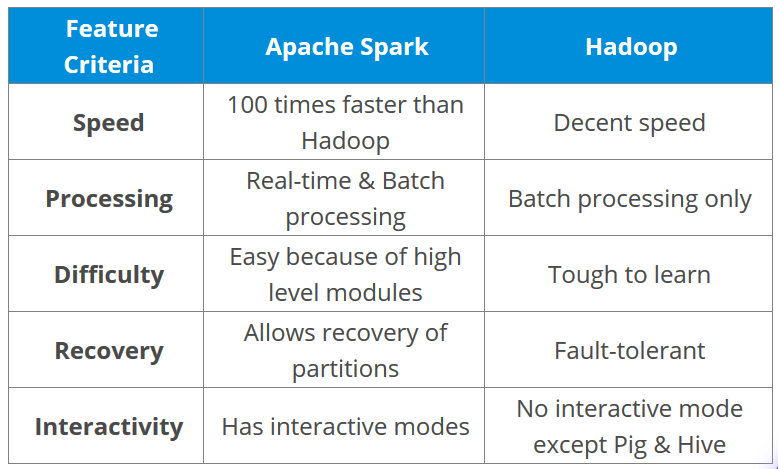
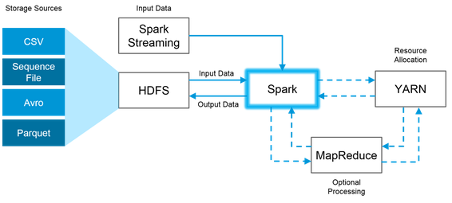

I was recently asked about how much do you know about Spark in an interview. Specifically, the interviewer asked about what was happening when you use a certain spark function, such as groupby. This motivates me to get a deeper understanding of how Spark process data.

Let's start with frequently asked interview questions and answers.

1. What is Apache Spark?
- It is a fast and general-purpose **cluster computing system**. At its core, it is a generic engine for processing large amounts of data. 
- It supports both real-time and batch processing

2. Features of Spark
- Polyglot: Spark provides high-level APIs in Java, Scala, Python and R. Spark code can be written in any of these four languages.
- Speed: Spark runs up to 100 times faster than Hadoop MapReduce for large-scale data processing. Spark is able to achieve this speed through **controlled partitioning**. It manages data **using partitions that help parallelize distributed data processing with minimal network traffic**.
- Multiple Formats: Spark supports multiple data sources such as Parquet, JSON, Hive and Cassandra. It supports the following three file systems: Hadoop Distributed File System (HDFS), local file system and AWS S3.
- Lazy Evaluation: Apache Spark **delays its evaluation till it is absolutely necessary**. This is one of the key factors contributing to its speed. **For transformations, Spark adds them to a DAG of computation and only when the driver requests some data, does this DAG actually gets executed.**
- Real Time Computation: Spark’s computation is real-time and has less latency because of its **in-memory** computation.
- Hadoop Integration: Apache Spark provides smooth compatibility with Hadoop. This is a great boon for all the Big Data engineers who started their careers with Hadoop. Spark is a potential replacement for the MapReduce functions of Hadoop, while Spark has the ability to run on top of an existing Hadoop cluster using YARN for resource scheduling. 
- Machine Learning: Spark’s MLlib is the machine learning component which is handy when it comes to big data processing. 

3. Compare Hadoop and Spark


- Faster: Due to the availability of **in-memory processing**, Spark implements the processing around 10 to 100 times faster than Hadoop MapReduce.
- Unlike Hadoop, Spark provides inbuilt libraries to **perform multiple tasks from the same core** like batch processing, Steaming, Machine learning, Interactive SQL queries. However, **Hadoop only supports batch processing.**
- Hadoop is highly **disk-dependent** whereas Spark promotes **caching and in-memory data storage**.
- Spark is capable of performing computations multiple times on the same dataset. This is called **iterative computation** while there is no iterative computing implemented by Hadoop.

**Spark can be used alongside Hadoop**
- HDFS: Spark can run on top of HDFS to leverage the distributed replicated storage.
- MapReduce: Spark can be used along with MapReduce in the same Hadoop cluster or separately as a processing framework.
- YARN: Spark applications can also be run on YARN
- Batch & Real Time Processing: MapReduce and Spark are used together where MapReduce is used for batch processing and Spark for real-time processing.



8. Name the components of Spark Ecosystem.
- Spark Driver: a program that runs on the master node of the machine and declares transformation and actions on data RDDs. It creates SparkContext, connected to a given Spark Master and delivers the RDD graphs to Master.
- Spark Core: Base engine for large-scale parallel and distributed data processing
- Spark Streaming: Used for processing real-time streaming data
- Spark SQL: Integrates relational processing with Spark’s functional programming API. It supports querying data either via SQL or via the Hive Query Language. It is capable of:
    - Loading data from a variety of structured sources.
    - Querying data using SQL statements, both inside a Spark program and from external tools that connect to Spark SQL through standard database connectors (JDBC/ODBC). For instance, using business intelligence tools like Tableau. 
    - Providing rich integration between SQL and regular Python/Java/Scala code, including the ability to join RDDs and SQL tables, expose custom functions in SQL, and more.
- GraphX: Graphs and graph-parallel computation
- MLlib: Performs machine learning in Apache Spark

5. Name types of Cluster Managers in Spark.

The Spark framework supports three major types of Cluster Managers:

- Standalone: A basic manager to set up a cluster.
- Apache Mesos: Generalized/commonly-used cluster manager, also runs Hadoop MapReduce and other applications.
- YARN: Responsible for resource management in Hadoop.

4. What is YARN?
YARN is one of the key features in Spark, providing a central and resource management platform to deliver scalable operations across the cluster. YARN is a **distributed container manager**, like Mesos for example, whereas Spark is a data processing tool. **Spark can run on YARN, the same way Hadoop Map Reduce can run on YARN.** Running Spark on YARN necessitates a binary distribution of Spark as built on YARN support. 

5. Explain the concept of Resilient Distributed Dataset (RDD).

RDD stands for Resilient Distribution Datasets. An RDD is a **fault-tolerant** collection of operational elements that **run in parallel**. The partitioned data in RDD is **immutable and distributed** in nature. There are primarily two types of RDD:

- Parallelized Collections: Here, the existing RDDs running parallel with one another.
- Hadoop Datasets: They perform functions on each file record in HDFS or other storage systems.

RDDs are basically **parts of data that are stored in the memory distributed across many nodes**. RDDs are lazily evaluated in Spark. This lazy evaluation is what contributes to Spark’s speed.

RDDs can be created by one of the two methods:
- By parallelizing a collection in your Driver program.
```Java
method val DataArray = Array(2,4,6,8,10)
val DataRDD = sc.parallelize(DataArray)
```
- By loading an external dataset from external storage like HDFS, HBase, shared file system.

RDDs support two types of operations: transformations and actions. 

- Transformations: Transformations are **functions to create new RDD from existing RDD**. Examples of transformations includes map, filter and reduceByKey. Transformations will not execute until an action occurs.

- Actions: Actions **return final results of RDD computations.** Actions **triggers execution** using lineage graph to load the data into original RDD, carry out all intermediate transformations and return final results to Driver program or write it out to file system. Example of actions include reduce() and take().

6. Define partitions in Apache Spark
Partitioning is the process to derive logical units of data to speed up the processing process. By default, Spark tries to read data into an RDD from the nodes that are close to it. Since Spark usually accesses distributed partitioned data, to optimize transformation operations it creates partitions to hold the data chunks. **Everything in Spark is a partitioned RDD.**

7. Define functions of SparkCore
Spark Core is the base engine for large-scale parallel and distributed data processing. The core is the distributed execution engine and performs various important functions like memory management, monitoring jobs, fault-tolerance, job scheduling and interaction with storage systems. Further, additional libraries, built atop the core allow diverse workloads for streaming, SQL, and machine learning. It is responsible for:

- Memory management and fault recovery
- Scheduling, distributing and monitoring jobs on a cluster
- Interacting with storage systems


9. How is Streaming implemented in Spark?

Spark Streaming is used for **processing real-time streaming data**. It enables **high-throughput and fault-tolerant** stream processing of live data streams. The fundamental stream unit is **DStream** which is basically a series of RDDs (Resilient Distributed Datasets) to process the real-time data. It is similar to batch processing as **the input data is divided into streams like batches**.

10. What is a Parquet file?

Parquet is **a columnar format file** supported by many other data processing systems. **Spark SQL performs both read and write operations with Parquet file** and consider it be one of the best big data analytics formats so far. 

The advantages of having a columnar storage are as follows:
- Columnar storage limits IO operations.
- It can fetch specific columns that you need to access.
- Columnar storage consumes less space.
- It gives better-summarized data and follows type-specific encoding.


12. Illustrate some demerits of using Spark.

The following are some of the demerits of using Apache Spark:

- Since Spark utilizes more storage space compared to Hadoop and MapReduce, there may arise certain problems.
- Developers need to be careful while running their applications in Spark.
- Instead of running everything on a single node, the work must be distributed over multiple clusters.
- Spark’s “in-memory” capability can become a bottleneck when it comes to cost-efficient processing of big data.
- Spark consumes a huge amount of data when compared to Hadoop.

13. How can you minimize data transfers when working with Spark?

Minimizing data transfers and avoiding shuffling helps write spark programs that run in a fast and reliable manner. The various ways in which data transfers can be minimized when working with Apache Spark are:

    Using Broadcast Variable- Broadcast variable enhances the efficiency of joins between small and large RDDs.
    Using Accumulators – Accumulators help update the values of variables in parallel while executing.

The most common way is to avoid operations ByKey, repartition or any other operations which trigger shuffles.
References:
1. https://www.edureka.co/blog/interview-questions/top-apache-spark-interview-questions-2016/